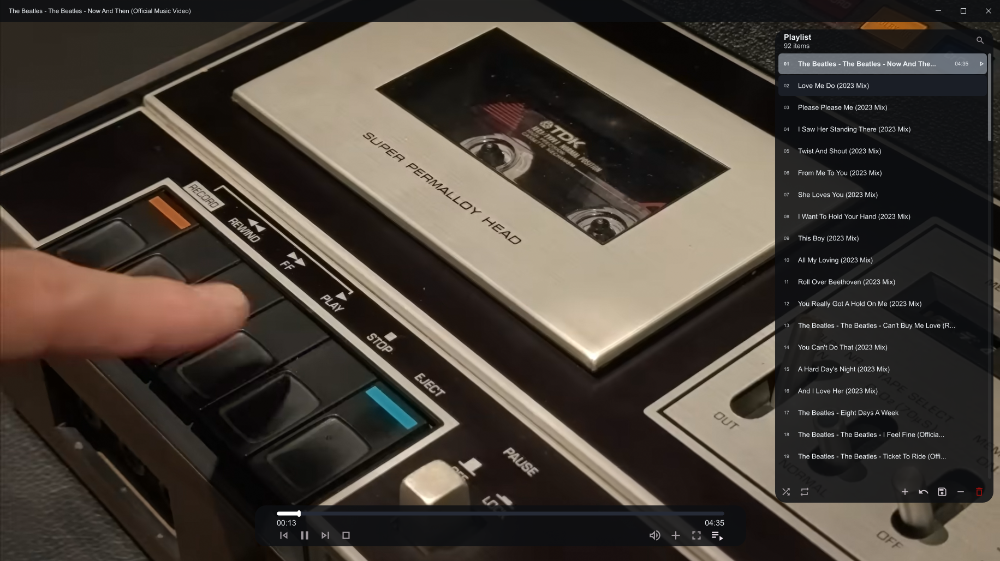

# Cadre UI for mpv

A modular graphical interface suite for the mpv media player. Cadre replaces the default UI with a desktop-first, neumorphic design featuring an advanced playlist manager, an interactive on-screen controller (OSC), and a custom frameless titlebar.

## Features

* **Cadre OSC:** A floating control bar featuring a dynamic seekbar, a volume flyout slider, and integrated menus for adding media.
* **Cadre Playlist:** A searchable, scrollable playlist overlay. Supports drag-and-drop reordering, dynamic text filtering, shuffle/repeat toggling, and native file deletion.
* **Cadre Titlebar:** A frameless window titlebar replacement with custom minimize, maximize, and close controls.
* **Native Dialogs:** Uses PowerShell integration to open native Windows file pickers, folder selectors, and text prompts directly within mpv.
* **Centralized Theming:** Colors, transparencies, dimensions, and typography are globally managed through a single configuration file.

## Requirements

* **mpv:** Latest release recommended.
* **Windows OS:** The scripts rely on `powershell` subprocesses to render native file dialogs and send files to the Recycle Bin.
* **Fonts:** The UI relies on **Material Icons Outlined** (OSC/Playlist) and **Segoe MDL2 Assets** (Titlebar). Ensure these are installed on your system to render icons correctly.

## Installation

1. Open your mpv configuration directory (typically `%APPDATA%\mpv\` on Windows).
2. Copy the following files into your `scripts` folder:
   * `cadre_common.lua`
   * `cadre_osc.lua`
   * `cadre_playlist.lua`
   * `cadre_titlebar.lua`
   * `cadre_theme.lua`
3. Open your `mpv.conf` file and add the following lines. This is **required** to disable the default UI, remove OS window borders, and prevent visual glitches during startup:
```ini
osc=no
osd-bar=no
border=no
autofit-smaller=800x450

```

## Configuration & Theming

All visual settings are controlled via `cadre_theme.lua`. You can modify this file to adjust hex color codes, alpha transparency levels, widget dimensions, and fonts. Overrides are available for specific components (e.g., setting `color_bar_bg_pl` allows the playlist to use a different background color than the global `color_bar_bg`).

### Routing Keyboard Shortcuts to Cadre (Shuffle Support)

By default, standard mpv keyboard bindings (`Enter`, `>`, etc.) trigger native playlist commands, which bypass Cadre's custom shuffle logic. To ensure keyboard shortcuts respect Cadre's shuffle state, route them to the script by adding these lines to your `input.conf`:

```ini
ENTER      script-message playlist-next
KP_ENTER   script-message playlist-next
>          script-message playlist-next
PGDN       script-message playlist-next
<          script-message playlist-prev
PGUP       script-message playlist-prev

```

## Default UI Keybindings

Cadre utilizes standard mouse interactions (click, drag, scroll) for its UI components. Specialized bindings include:

* **`DEL`** : Remove the selected item from the Cadre playlist.
* **`Shift+DEL`** : Delete the selected file from your hard drive (moves to the Windows Recycle Bin).

## Optional: Thumbnail Previews (Thumbfast)

Cadre OSC includes built-in support for seekbar thumbnail previews using [thumbfast](https://github.com/po5/thumbfast?utm_source=gemini).

To enable this feature:

1. Download `thumbfast.lua` from its repository.
2. Place `thumbfast.lua` into your mpv `scripts` directory alongside the Cadre files.
3. Cadre will automatically detect it and display thumbnails when hovering over the seekbar. No additional configuration is required.
