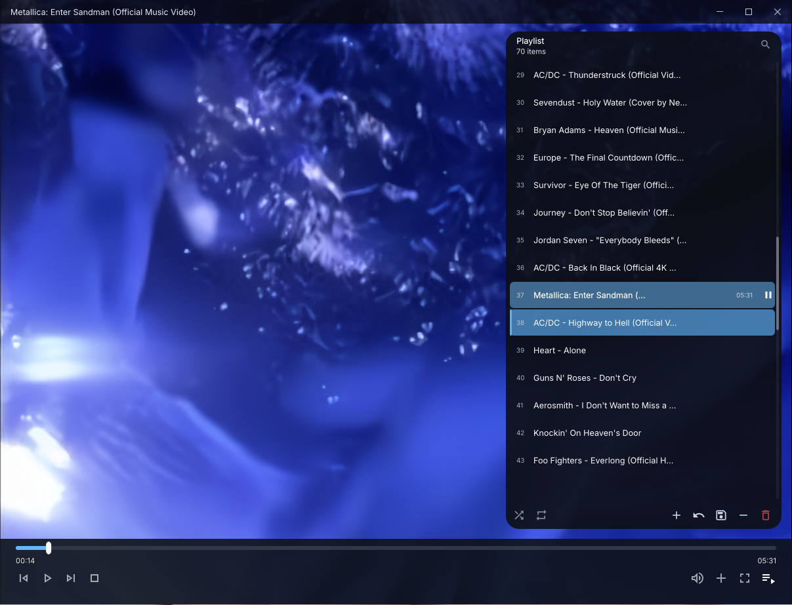
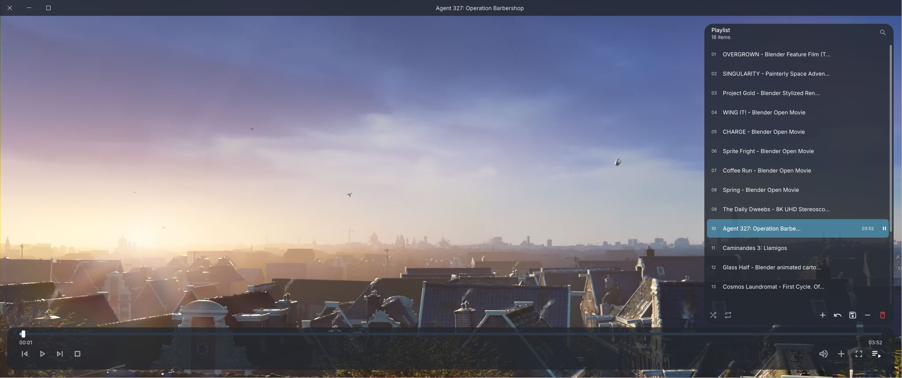
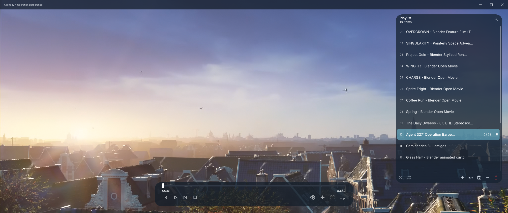
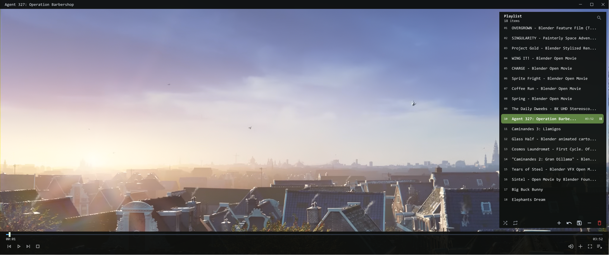
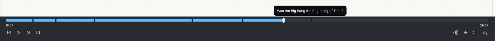

# Cadre UI for mpv











Cadre is a modular UI suite for [mpv](https://mpv.io/). Its components can be used together as one interface or enabled separately according to your workflow.

Every Cadre component requires these two shared files:

- `cadre_common.lua` - shared helpers, native Windows dialogs, playlist actions, drawing utilities, and UI coordination.
- `cadre_theme.lua` - the shared theme and layout configuration.

The optional UI components are:

- `cadre_osc.lua` - customizable on-screen controls, seeking, volume, chapter markers, chapter tooltips, and optional seek thumbnails.
- `cadre_playlist.lua` - a visual playlist and queue manager.
- `cadre_titlebar.lua` - a custom titlebar with minimize, maximize/restore, and close controls.

## Features

### Modular components

Use any combination of the components:

| Component | Required shared files | Can be used alone? |
| --- | --- | --- |
| OSC | `cadre_common.lua`, `cadre_theme.lua` | Yes |
| Playlist | `cadre_common.lua`, `cadre_theme.lua` | Yes |
| Titlebar | `cadre_common.lua`, `cadre_theme.lua` | Yes |
| Full Cadre UI | All files above | Yes, as a complete suite |

The components detect one another when present and coordinate mouse input, window dragging, and playlist controls. If a related component is not installed, the available component falls back to normal mpv commands where appropriate.

### Cadre OSC

- Customizable control bar layout: use a floating bar, a full-width bar, or configure your own dimensions and insets through `cadre_theme.lua`.
- Seekbar with hover expansion and draggable seeking.
- Volume flyout with a vertical volume slider.
- Add-file, add-folder, and add-URL menus using native Windows dialogs.
- Previous, play/pause, next, stop, fullscreen, and playlist controls.
- Chapter markers on the seekbar.
- Chapter-name tooltips when hovering chapter markers.
- YouTube chapter loading for YouTube URLs and streams when `yt-dlp` is available.
- Optional seekbar thumbnail previews through [thumbfast](https://github.com/po5/thumbfast).

### Cadre Playlist

- Searchable and scrollable playlist overlay.
- Multiple selection with Ctrl-click and range selection with Shift-click.
- Double-click to play an item.
- Drag-and-drop reordering, including selected groups.
- Remove selected entries from the playlist.
- Move local files to the Windows Recycle Bin with `Shift+DEL`.
- Shuffle playback order without changing the visible playlist order.
- Repeat modes: off, repeat playlist, and repeat current item.
- Save and load M3U/M3U8 playlists.
- Per-item duration display when mpv has reported the duration.

### Cadre Titlebar

- Frameless custom titlebar for borderless mpv windows.
- Minimize, maximize/restore, and close controls.
- Configurable button side: Windows-style right side or macOS-style left side.
- Configurable startup visibility and title alignment.
- Coordinates with the playlist and OSC so window dragging does not interfere with controls.

### Centralized theming

`cadre_theme.lua` controls colors, alpha values, fonts, typography, component-specific overrides, dimensions, spacing, radii, and visibility behavior. The OSC layout is intentionally configurable rather than fixed to one visual style.

## Requirements

- Windows.
- A current mpv build.
- PowerShell, used for native file/folder/URL dialogs and Recycle Bin integration.
- `Material Icons Outlined` for the OSC and playlist icons.
- `Segoe MDL2 Assets` for the titlebar icons.
- `yt-dlp` in `PATH` if you want chapters loaded automatically from YouTube URLs.
- `thumbfast.lua` and its dependencies if you want seekbar thumbnail previews.

The UI can still run if optional icon fonts or optional integrations are unavailable, but some icons or features may not render or activate correctly.

## Installation

1. Copy the desired Cadre files into mpv's `scripts` directory. For the complete UI, copy:

   ```text
   cadre_common.lua
   cadre_theme.lua
   cadre_osc.lua
   cadre_playlist.lua
   cadre_titlebar.lua
   ```

2. For a partial setup, copy `cadre_common.lua`, `cadre_theme.lua`, and only the component files you want.

3. Add the following to `mpv.conf` when using the Cadre OSC or titlebar:

   ```ini
   osc=no
   osd-bar=no
   border=no
   autofit-smaller=800x450
   ```

   `border=no` is needed for the custom titlebar and for a consistent borderless layout. If you use only the playlist, the other settings are optional.

4. Restart mpv. mpv automatically loads Lua scripts placed in its `scripts` directory.

A typical Windows portable layout looks like this:

```text
mpv/
├─ mpv.conf
└─ scripts/
   ├─ cadre_common.lua
   ├─ cadre_theme.lua
   ├─ cadre_osc.lua
   ├─ cadre_playlist.lua
   └─ cadre_titlebar.lua
```

## Choosing Components

Because mpv loads scripts from the `scripts` directory, selective use is easiest when only the desired Cadre component files are present there:

- OSC only: `cadre_common.lua`, `cadre_theme.lua`, `cadre_osc.lua`
- Playlist only: `cadre_common.lua`, `cadre_theme.lua`, `cadre_playlist.lua`
- Titlebar only: `cadre_common.lua`, `cadre_theme.lua`, `cadre_titlebar.lua`
- Complete UI: all five Cadre files

Other unrelated scripts can remain in the same directory.

## Configuration and Themes

Edit `cadre_theme.lua` to customize the active UI. Settings include:

- Global and per-component colors.
- Transparency values.
- Fonts and font sizes.
- OSC bar width, height, margins, radius, seekbar position, and control spacing.
- Playlist panel width, row height, insets, toolbar, search field, and scrollbar.
- Titlebar height, button width, button side, and startup visibility.
- Chapter marker and tooltip appearance.

### Sample themes

The repository may include a `theme` folder containing sample theme files. Those files are examples, not files that Cadre loads automatically.

To try a sample theme:

1. Open the sample theme file from the `theme` folder.
2. Copy its contents.
3. Paste the contents into your active `cadre_theme.lua`, replacing the current theme configuration.
4. Restart mpv.

Keep one active `cadre_theme.lua` in the mpv `scripts` directory. Do not rename the active file unless you also update every Cadre script that loads it.

## Playlist Shuffle Shortcuts

Cadre's playlist shuffle mode controls the custom `playlist-next` and `playlist-prev` script messages. Native mpv playlist shortcuts bypass that custom order, so route your next/previous keys through Cadre in `input.conf`:

```text
ENTER      script-message playlist-next
KP_ENTER   script-message playlist-next
>          script-message playlist-next
PGDN       script-message playlist-next
<          script-message playlist-prev
PGUP       script-message playlist-prev
```

You can use different keys; the important part is sending `script-message playlist-next` and `script-message playlist-prev` while `cadre_playlist.lua` is loaded.

The OSC automatically sends these messages to the playlist component when it is installed. Without the playlist component, the OSC falls back to mpv's normal previous/next commands.

## Default Controls

The UI uses mouse controls for clicking, scrolling, selecting, dragging, and seeking.

| Shortcut | Action |
| --- | --- |
| `DEL` | Remove selected entries from the playlist. |
| `Shift+DEL` | Move selected local files to the Windows Recycle Bin and remove them from the playlist. |

The playlist can also be opened or controlled through mpv script messages:

```text
script-message toggle-playlist
script-message playlist-next
script-message playlist-prev
```

The titlebar can be toggled with:

```text
script-message toggle-titlebar
```

## Thumbfast Thumbnail Previews

Cadre OSC can display seekbar thumbnails through [thumbfast](https://github.com/po5/thumbfast/).

1. Place `thumbfast.lua` in mpv's `scripts` directory. The repository may already include a compatible copy.
2. Keep `cadre_osc.lua` installed alongside it.
3. Start or restart mpv and hover over the OSC seekbar.

Cadre communicates with thumbfast automatically. Thumbfast's own configuration and external requirements still apply; consult its documentation if thumbnails do not appear.

## Notes

- Native dialogs and Recycle Bin operations are Windows-specific.
- Playlist deletion is intended for local files. URLs and streams cannot be sent to the Recycle Bin.
- The titlebar is most useful with `border=no`.
- Reload or restart mpv after changing the theme or adding/removing Cadre component files.

## License

See the repository license for usage and redistribution terms.
